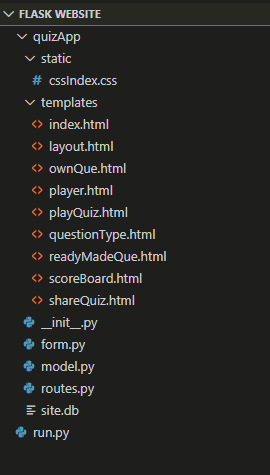
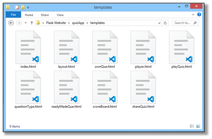
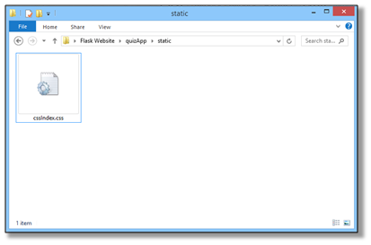

# Quiz Web Application in Flask
<br>

*  ### Project tree structure
<br>

<br>

Create <b>__init__.py</b> file inside a folder with name <b>quizApp</b> and then initialize and configure our application such as creating instance of <b>Flask</b>, <b>SQLAlchemy</b>, <b>LoginManager</b> classes and configure them and finally importing routes from routes.py as shown below.

<br>

```python
from flask import Flask
from flask_sqlalchemy import SQLAlchemy
from flask_login import LoginManager
app = Flask(__name__)
app.config['SECRET_KEY'] = ''
app.config['SQLALCHEMY_DATABASE_URI'] = ''
db = SQLAlchemy(app)
login_manager = LoginManager(app)
login_manager.login_view = 'index'
app.config['SQLALCHEMY_TRACK_MODIFICATIONS'] = True
from quizApp import routes
```
<br>
Create <b>routes.py</b> in the same folder and create all the routes required for our Application. Here in this example we can see only 2 routes but there are total 10 routes in this application including the following given routes.

<br>
<br>

1) <b>index</b> route :
```python
@app.route('/', methods = ['GET', 'POST'])
@app.route('/index', methods = ['GET', 'POST'])
def index():
    if current_user.is_authenticated:
        return redirect(url_for('scoreBoard', _UID = current_user.userID))
    #..
    if form.validate_on_submit():
        #..
        return redirect(url_for('questionType'))
    return render_template('index.html', form = form)
```
<br>

2)	<b>questionType</b> route :
```python
@app.route('/questionType', methods = ['GET', 'POST'])
@login_required
def questionType():
    form1 = SubmitOwn()
    form2 = SubmitReady()
    if bool(Q_A.query.filter_by(user_ID = current_user.userID).first()):
        return redirect(url_for('scoreBoard', _UID = current_user.userID))
    if form1.submitOwn.data:
        return redirect(url_for('ownQue'))
    if form2.submitReady.data:
        return redirect(url_for('readyMadeQue'))
    return render_template('questionType.html', form1 = form1, form2 = form2)
```
<br>
There are other routes such as <b>ownQue</b>, <b>readyMadeQue</b>, <b>shareQuiz</b>, <b>playQuiz</b>, <b>scoreBoard</b>, <b>player</b> and <b>logout</b> routes in this application. Create <b>template</b> and <b>static</b> folders which will include html and css files for our application.
<br>
<br>



<br>
Now let’s create <b>WTForms</b> for our Applications so that we can take user inputs and store it in our database. For creating <b>WTForms</b> lets first create <b>form.py</b> inside the same directory as <b>__init__.py</b> and <b>routes.py</b> file as shown in <i>Project Tree</i>. Inside of <b>form.py</b> lets create all the forms classes by inheriting the <b>FlaskForm</b> class form <b>flask_wtf</b> module and make instance of <b>wtforms</b> classes as field for our forms.
<br>
<br>

```python
class RegisterName(FlaskForm):
    username = StringField('Enter Your Name', validators=[DataRequired(), Length(min=2, max=20)])
    submit = SubmitField('Create Quiz')
class SubmitOwn(FlaskForm):
    submitOwn = SubmitField('Create your own questions')
class SubmitReady(FlaskForm):
    submitReady = SubmitField('Ready-made questions')
class ReadymadeForm(FlaskForm):
    #..
class OwnMade(FlaskForm):
    #..
class PlayQuiz(FlaskForm):
    nxt = SubmitField('SUBMIT')
class PlayerForm(FlaskForm):
    #..
```

After creating all the <b>templates</b>, <b>routes</b> and <b>forms</b> for our application lets create the <b>sqlite</b> database for our application by creating a <b>model.py</b> file which will include all the tables and their columns as classes which inherits <b>db.Model</b> and <b>UserMixin</b> classes. <b>model.py</b> file will also include login_manager which will handel login sessions of user for the database.

```python
@login_manager.user_loader
def laod_user(userID):
    return Users.query.get(int(userID))

class Users(db.Model, UserMixin):
    __tablename__ = 'Users'
    userID = db.Column(db.Integer, nullable = False, primary_key = True, autoincrement = True)
    name = db.Column(db.String, nullable = False)
    QAs = db.relationship('Q_A', backref = 'U_ID', lazy = 'dynamic')
    def get_id(self):
        return (self.userID)
    def __repr__(self):
        return f'User("{self.userID}", "{self.name}")'
class Q_A(db.Model, UserMixin):
    __tablename__ = 'Q_A'
    #..
class Player(db.Model, UserMixin):
    __tablename__ = 'Player'
    #..
class Scoreboard(db.Model, UserMixin):
    __tablename__ = 'Scoreboard'
    #..
class Readymade(db.Model, UserMixin):
    #..
```

At last lets create <b>run.py</b> file which only when executed will run and initialize our entire project in the parent directory of the project folder as shown in <i>Project Tree</i>.

<br>

```python
from quizApp import app
if __name__ == '__main__':
app.run(debug = False)
```
<br>
But before running the Application with <b>run.py</b>file first create and initialize the <b>site.db</b> database to store the data in it. To create the database and initialize it open the terminal or Command prompt in the project directory and run the python interpreter inside it.
<br>

```python
E:\Flask Website>python
Python 3.8.2 ..
>>> from quizApp import db
>>> db.create_all()
>>>
```

After starting the python interpreter import the <b>db</b> instance from our <b>__init__.py</b> through <b>quizApp</b> folder, you may get some warning but it’s just some deprecation warning. After importing <b>db</b> which is our <b>SQLAlchemy</b> class instance call the <b>create_all()</b> method from it which will create <b>site.db</b> database for our project.
After successfully creating our database file now we are ready to run our Application on <b>localhost</b> by running the <b>run.py</b> file which will start host a local server at a particular port which will shown with address of <b>localhost</b>. You can now enter that address of <b>localhost</b> at which your application is running inside your URL field of browser.
I have also hosted this application online you can check it by visiting below link of our Web Application.

https://who-knows-me-better.herokuapp.com


```python

```
